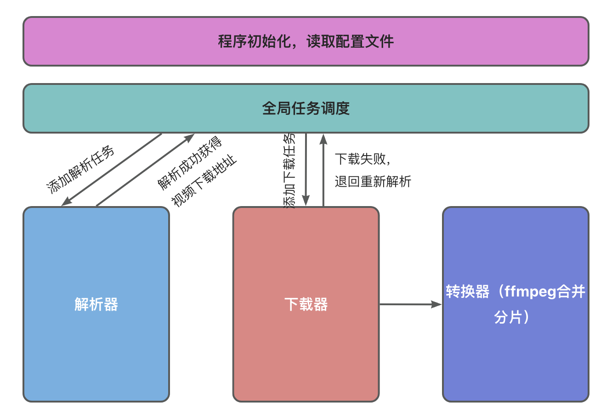
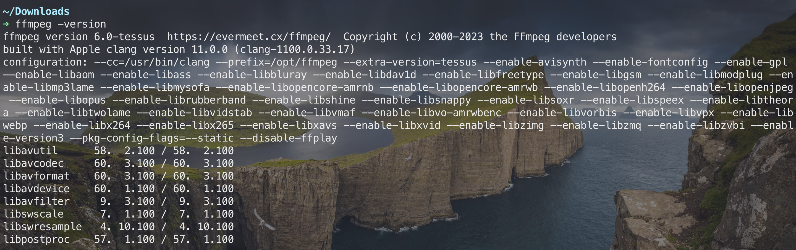
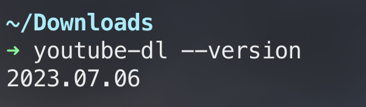
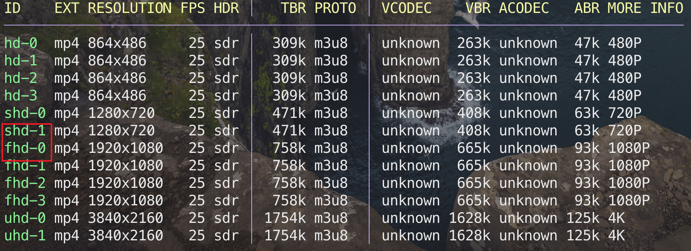
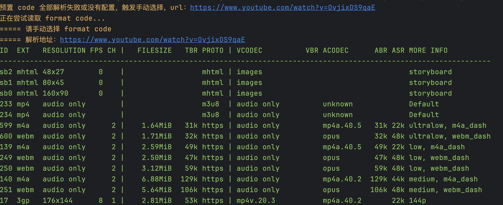

# video-downloader

这是一个使用 Java 语言编写的多线程视频下载器，适配 “爱优腾芒”。开发这个项目的目的就是为了**批量下载**视频的时候解放双手，不需要手动转换 m3u8，也不需要等到视频下载完成之后再去一个一个改名。

一句话总结这个项目：类似 docker-compose，本项目就是将下载的任务以及下载方式提前通过配置的方式编排好，然后启动程序自动下载。

适用场景：

- 批量下载视频
- 文件名称提前配置
- 自动将 ts 文件合并成 mp4



## 技术栈

- Java

- Selenium（模拟真实浏览器环境，访问接口解析地址）

- BrowserBomProxy（代理模拟浏览器的 `http` 请求，捕获视频下载地址）

## 环境要求

1. Java（JDK 1.8 以上）
2. ffmpeg

直接到官网[下载页](https://ffmpeg.org/download.html)下载可执行文件，并将 `ffmpeg` 配置到**环境变量**中。

在终端任意目录下执行 `ffmpeg -version` 能够正常输出即可：



3. youtube-dl

推荐下载 [yt-dlp](https://github.com/yt-dlp/yt-dlp)，安装完成后，**请到可执行文件所在路径，将 `yt-dlp` 文件名修改为 `youtube-dl` 或者添加一个软链接**

在终端任意目录下执行 `youtube-dl --version` 能够正常输出即可：



4. ChromeDriver

如需使用除了 `youtube-dl` 之外的解析器，如解析网页中的视频地址、提取解析接口中解析出来的视频地址等，需要安装 **Chrome** 浏览器以及 [ChromeDriver](https://chromedriver.chromium.org/downloads)，确保 ChromeDriver 和 Chrome 的版本号一致（最起码大版本号一致），并按照示例配置文件配置好 ChromeDriver 可执行文件的绝对路径

## 安装&使用

1. 下载压缩包，解压

```shell
curl -L -o video-downloader-1.1.0.zip https://github.com/AmbitiousJun/video-downloader/releases/download/v1.1.0/video-downloader-1.1.0.zip

unzip ./video-downloader-1.1.0.zip
```

2. 复制一份配置文件

```shell
cd video-downloader-1.1.0/config
cp config-example.yml config.yml
```

3. 修改 config.yml

默认情况下，转换器保持 ffmpeg 的配置不需要改变。只需修改 ChromeDriver 路径，解析器，下载器的配置即可

4. 修改 data.txt

在这个文件中编写下载任务，每一行是一个任务，格式：`文件名｜url`，文件名不需要包含扩展名。

5. 启动程序

```shell
java -jar downloader.jar
```

## 示例

1. 不使用解析器，多线程下载 mp4 格式视频

data.txt:

```shell
这是一个视频|https://example.com/test.mp4
```

config.yml:

```yml
decoder: # 解码器相关配置
  use: none # 使用哪种解析方式，可选值：none, free-api, vip-fetch, youtube-dl，若使用 youtube-dl，resource-type 会被忽略
  resource-type: mp4 # 解析出来的文件类型，可选值：mp4, m3u8

downloader:
  use: multi-thread # 要使用哪个下载器，可选值：simple, multi-thread
  task-thread-count: 1 # 处理下载任务的线程个数
  dl-thread-count: 32 # 多线程下载的线程个数
  download-dir: /Users/ambitious/Downloads # 视频文件下载位置
  ts-dir-suffix: temp_ts_files # 暂存 ts 文件的目录后缀【保持默认即可】
```

2. 不使用解析器，多线程下载 m3u8 视频，并自动合并为 mp4

data.txt:

```shell
这是一个视频|https://example.com/test.m3u8
```

config.yml:

```yml
decoder: # 解码器相关配置
  use: none # 使用哪种解析方式，可选值：none, free-api, vip-fetch, youtube-dl，若使用 youtube-dl，resource-type 会被忽略
  resource-type: m3u8 # 解析出来的文件类型，可选值：mp4, m3u8

downloader:
  use: multi-thread # 要使用哪个下载器，可选值：simple, multi-thread
  task-thread-count: 1 # 处理下载任务的线程个数
  dl-thread-count: 32 # 多线程下载的线程个数
  download-dir: /Users/ambitious/Downloads # 视频文件下载位置
  ts-dir-suffix: temp_ts_files # 暂存 ts 文件的目录后缀

transfer:
  use: ffmpeg # 要选用哪个转码器，可选值：file-channel, cv, ffmpeg【保持ffmpeg不变即可】
  ts-filename-regex: (?<=_)(\d+)(?=\.) # 正则表达式，用于匹配出 ts 文件的序号
```

3. 使用解析器，但不需要免费解析接口，直接从目标网页上抓取视频

data.txt

```shell
开始推理吧.S01E01|https://www.freeok.me/play/36878-1-1.html
```

config.yml:

```yml
decoder: # 解码器相关配置
  use: free-api # 使用哪种解析方式，可选值：none, free-api, vip-fetch, youtube-dl，若使用 youtube-dl，resource-type 会被忽略
  resource-type: m3u8 # 解析出来的文件类型，可选值：mp4, m3u8
  free-api: # 使用免费接口进行解析的相关配置
    use: Direct # 要使用的解析接口，必须和 decoder.free-api.apis 配置列表中的任意一个匹配
    apis: # 免费接口列表，格式：name,url
      - Direct,
    valid-url-prefixes: # 各大视频网站解析出来的资源地址前缀【可使用“猫抓”工具抓取视频地址，并提取域名】
      - https://vz-asp83m00-ts2.immmm.top
    wait-seconds: 30 # 使用 Selenium 访问解析接口，在页面中等待解析的时间（秒）
```

4. 使用免费解析接口，多线程下载视频（以 TX 为例）

data.txt:

```shell
这是一个视频|https://v.qq.com/x/cover/mzc00200ynivua7/r00434mq14v.html
```

config.yml:

```yml
decoder: # 解码器相关配置
  use: free-api # 使用哪种解析方式，可选值：none, free-api, vip-fetch, youtube-dl，若使用 youtube-dl，resource-type 会被忽略
  resource-type: mp4 # 解析出来的文件类型，可选值：mp4, m3u8
  free-api: # 使用免费接口进行解析的相关配置
    use: XiaMi # 要使用的解析接口，必须和 decoder.free-api.apis 配置列表中的任意一个匹配
    apis: # 免费接口列表，格式：name,url
      - JsonPlayer,https://jx.jsonplayer.com/player/?url=
      - XiaMi,https://jx.xmflv.com/?url=
      - Direct,
    valid-url-prefixes: # 各大视频网站解析出来的资源地址前缀【可使用“猫抓”工具抓取视频地址，并提取域名】
      - om.tc.qq.com
      - gtimg.com
      - https://cache.m3u8.pw/Cache/qq
      - https://videocut-upload-sz.oss-cn-shenzhen.aliyuncs.com
      - https://cache.xmflv.cc:4433/Cache/qq
      - https://sluiceyf.titan.mgtv.com
      - https://pcvideoaliyun.titan.mgtv.com
      - https://vz-asp83m00-ts2.immmm.top
      - https://upos-sz-mirrorcos.bilivideo.com/upgcxcode
    wait-seconds: 30 # 使用 Selenium 访问解析接口，在页面中等待解析的时间（秒）
```

5. 已有 “爱优腾芒” 等视频网站的会员，需要批量下载网站上的视频

由于解析器 `vip-fetch` 可以被 `youtube-dl` 完美替代，这里就不介绍 `vip-fetch` 的使用了，代码也只写了一半，没必要用。

data.txt:

```shell
开始推理吧.S01E01|https://v.qq.com/x/cover/mzc00200ynivua7/r00434mq14v.html
开始推理吧.S01E02|https://v.qq.com/x/cover/mzc00200ynivua7/r00434mq14v.html
开始推理吧.S01E03|https://v.qq.com/x/cover/mzc00200ynivua7/r00434mq14v.html
开始推理吧.S01E04|https://v.qq.com/x/cover/mzc00200ynivua7/r00434mq14v.html
开始推理吧.S01E05|https://v.qq.com/x/cover/mzc00200ynivua7/r00434mq14v.html
开始推理吧.S01E06|https://v.qq.com/x/cover/mzc00200ynivua7/r00434mq14v.html
开始推理吧.S01E07|https://v.qq.com/x/cover/mzc00200ynivua7/r00434mq14v.html
开始推理吧.S01E08|https://v.qq.com/x/cover/mzc00200ynivua7/r00434mq14v.html
开始推理吧.S01E09|https://v.qq.com/x/cover/mzc00200ynivua7/r00434mq14v.html
开始推理吧.S01E10|https://v.qq.com/x/cover/mzc00200ynivua7/r00434mq14v.html
```

仍然是以 TX 为例，首先选取要下载的视频格式，在终端上运行：

```shell
youtube-dl -F "https://v.qq.com/x/cover/mzc00200ynivua7/r00434mq14v.html" --cookies-from-browser chrome
```

如果是会员才能观看的视频，需要先在浏览器登录会员账号，并注入 cookie，我这里以 chrome 为例，运行结果：



我想优先下载 1080p 格式，如果该格式下载失败的话，就下载 720p 的，那么配置文件这么写：

config.yml:

```yml
decoder: # 解码器相关配置
  use: youtube-dl # 使用哪种解析方式，可选值：none, free-api, vip-fetch, youtube-dl，若使用 youtube-dl，resource-type 会被忽略
  youtube-dl: # youtube-dl 解析器相关配置
    cookies-from: chrome # 从哪个浏览器获取 cookie，该参数会直接传递给 youtube-dl，传入 none 则忽略
    format-codes: # 下载视频的编码，可传多个，按照顺序进行解析，两种格式：'视频编码+音频编码' 或者 '视频编码'，只会下载首次解析成功的格式
      - fhd-0
      - shd-1

downloader:
  use: multi-thread # 要使用哪个下载器，可选值：simple, multi-thread
  task-thread-count: 1 # 处理下载任务的线程个数
  dl-thread-count: 32 # 多线程下载的线程个数
  download-dir: /Users/ambitious/Downloads # 视频文件下载位置
  ts-dir-suffix: temp_ts_files # 暂存 ts 文件的目录后缀

transfer:
  use: ffmpeg # 要选用哪个转码器，可选值：file-channel, cv, ffmpeg
  ts-filename-regex: (?<=_)(\d+)(?=\.) # 正则表达式，用于匹配出 ts 文件的序号
```

6. 已有 “爱优腾芒” 等视频网站的会员，需要批量下载网站上的视频，但是要下载的视频太多，懒得自己一个一个获取 format code

大多数视频网站中，通常情况下相同系列的视频相同格式它的 format code 是一样的，只需提前配置好一个 format code，就能解析下载全部视频。

但是像 MG 就不行了，每个视频的 format code 都是随机的，要下载 40 个视频，就要手动获取 40 个 format code，**非常地不银杏**。

这个时候就可以用到程序的自动获取 format code 功能了，当 config.yml 中配置的 format code 全部解析失败时，会触发这个逻辑：



如果不想要自己提前手动获取 format code，那么 config.yml 中，`downloader.youtube-dl.format-codes` 配置就不需要传递任何内容，像这样：

```yml
decoder: # 解码器相关配置
  use: youtube-dl # 使用哪种解析方式，可选值：none, free-api, vip-fetch, youtube-dl，若使用 youtube-dl，resource-type 会被忽略
  youtube-dl: # youtube-dl 解析器相关配置
    cookies-from: chrome # 从哪个浏览器获取 cookie，该参数会直接传递给 youtube-dl，传入 none 则忽略
    format-codes: # 下载视频的编码，可传多个，按照顺序进行解析，两种格式：'视频编码+音频编码' 或者 '视频编码'，只会下载首次解析成功的格式
```

有的时候会因为网络问题导致 format code 生成异常，可以直接敲回车重新获取。
